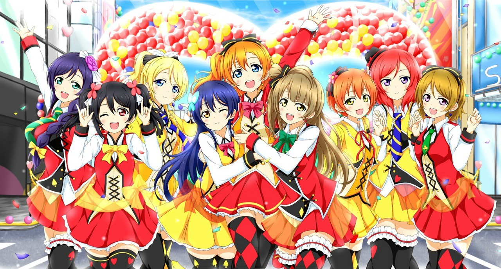
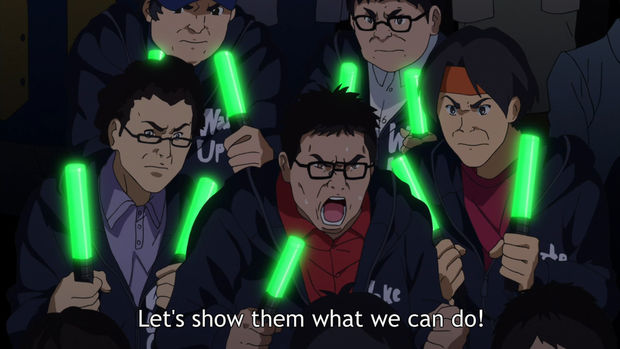

I was originally planning on writing this the day after the event, once I were rested, but due to work and other activities it seems like I wasn't able until now, a week later.

---

 

This screening took place at the last day of the LA Anime Film Festival, and had the special appeal to be a *Cheering Style* screening, meaning that we were encouraged to bring KBs, penlights and cyalumes to use them during the movie. I guess that being allowed to do calls was what made me took a 3 hour trip from Tijuana to LA, rather than the movie itself.

I'm pretty sure most (if not all) of the attendees had already watched the movie, so the plot itself was not the main point of the event. Instead this screening was intended to be more of a "watch together and have fun with other fans" event.

I'm somehow still not comfortable with the practice of wearing anime "battle gear" to events, so I wore normal light clothes and a small bag containing my KBs and penlights. As expected thought, most people were either wearing some Love live shirts or carrying Nesos around.

<blockquote class="twitter-tweet" data-lang="en">
  

    So...which film are you guys waiting for again?
    <a href="https://twitter.com/hashtag/LAAFF?src=hash">#LAAFF</a>
    <a href="https://t.co/SjYlGxWbgC">pic.twitter.com/SjYlGxWbgC</a>
  

  &mdash; LA-AFF (@LAAnimeFF)
  <a href="https://twitter.com/LAAnimeFF/status/909486092633513984">17 de septiembre de 2017</a>
</blockquote>
 

Something I didn't expect to see was that the most "equipped" people were using Aqours-related gear, instead of µ's. I know Aqours is popular but I did not expect to see so much people supporting them at a µ's event. I mean, I'm glad to see the people supporting the franchise but kinda felt a little bit out of place.

---

My seat was kind bad (first row before the space in the middle of the auditorium) but was the closest to where the peoples with most cyalumes and KBs were so I felt like it was the most fun area to be. It was actually a fun area to be but being on the first row it's not as fun as you don't get to see a lot of people waving kbs and doing furi, other than a couple on your same row, as just a couple of people in the front section had penlights. Now I'm worried as my seat for Aqours 2L DV is on the first row as well :/

Going into the screening itself, as expected we did a little wota while waiting for the movie to start. From what I can remember we did Snow Halation, START:DASH!!, Kore wa Bokutachi no Kiseki, a couple slow ones and like 30 seconds of a WUG song (I think it was either Shoujo KKK or Beyond the Bottom, can't really remember).

 

Once the movie began, doing keccha at the BGM was fun. And was cool seeing how I was not the only one who had memorized certain lines lol

While I enjoyed that and people throwing jokes at the beginning, after a like a minute or two I grew worried about this persisting through the entire movie. Luckily that didn't happen so kudos to people for understanding when it's ok to joke and when you should just sit and enjoy the show.

Starting with the songs, we first got ***Hello, Hoshi o Kazoete*** that as you might know doesn't have calls in it other than the intro `Hai`s so we just waved along. For this one I tri-wielded penlights starting with the 3x Yellows and changed into yellow (Rin) , red (Maki) and green (Hanayo) after the Rin solo.

When we got to the mysterious DEFINITELY-NOT-HONOKA girl singing in the streets I felt like I had to keccha and so did I, dual-wielding orange. Fun thing about this is that this was the first time I felt like doing furi at ***As Times Go By***, so I guess that you can call that the power of a group viewing.

***Angelic Angel*** was next and so the light blue king blades were turned on. Calls-wise this one is pretty light (just intro `Hai`s, a couple `Fu`s and the `ANGEL` shout) but it was done pretty well.

Once ***？←HEARTBEAT*** started, the crowd got really hyped. One must recognize how much west fans love Nico and how much enjoy her solo and unit songs, even if it's just the result of her memes getting popular. KBs were obviously third year colors: light-blue (Eli), pink (Nico), and purple (Nozomi). I was, however, kinda disappointed because so few people chanted the `FuFuFu`s during the second verse, which it's basically the song's core call, but I guess that's ok as most people are more interested on chorus calls.

A-RISE's ***Shocking party*** was more well received than I was expecting but lasted like 30 seconds so we were cut just when the hype was starting.

After a long break watching the story, ***Future Style*** began. My KBs were set at blue (Umi), light-gray (Kotori) and orange (Honoka); the second year colors. For the most part, calls were fine (`Hai`s at the intro and the `Alarm`->`PPPH`->`Hai` combo were done pretty well), but like no one did the `FuFuFu`s at the chorus so I felt a little bit out of place.

Going into the last part, ***SUNNY DAY SONG*** came. Now, if you know me you'll know that this one is one of my favorites songs ever and I love the calls in this one as well as doing furi-copy at the chorus. I started dual-wielding  yellow + red (same core color as the µ's outfits) and switched to both orange at the Honoka solo. Being on the front row, I wasn't really able to see if people did furi-copy along with me at the chorus so I can't really comment on that. I was aware that people may avoid the `Fu`->`Fu`->`Fuwax4` combo, as there's 2 variants for this song's calls: one with the combo and one without it; so I was not surprised when it wasn't present at the chorus. But it really made me sad that so few (2-3 at max) did the `PPPH`->`HAI` combo. Like I said, I love this song and the calls in it so not hearing such an easy to predict call really shocked me. Also the `AISU` and `SIGN` shouts weren't there. IF IT'S A SUNNY DAY, WHY IT'S RAINING INSIDE ME ;_;

Last one was ***Bokutachi wa Hitotsu no Hikari***. This song really hits me every time. I will not lie, I did drop one or two tears while singing this one. It's just such a beautiful and powerful song. I pre-programmed my two King Blades with the color sequence for this song so when it started I was already prepared and went changing
the
colors
as each girl name came out. For the last part I decided to stay with orange, mostly because of how much I enjoy that song. It's a pretty light song call-wise but it felt damn great every time I shouted `IMA GA SAIKOU!!` from the bottom of my lungs (or maybe it came from the bottom of my heart).

After the movie ended, I just got some food and went on another 3 hour trip back home, feeling really tired but happy about that day.

---

Wrapping up, it was a really cool experience and I'm really glad to see again that there's so many people sharing the love for school idols.

I do think that call-wise we have room for improvement but that's just me saying it as a call enthusiast.

Personally, I'm going to try and improve my lead. While I may know a lot of Love Live calls, I have a naturally low voice so at this event I learned that I should try harder next time to shout out louder and lead other fans so calls don't get lost next time.

Also, I just want to remind you that calls and idols events are supposed to be enjoyable and, as long as you are having fun, there's no need to be perfect or to learn all the calls, so don't worry about that and just enjoy!!

