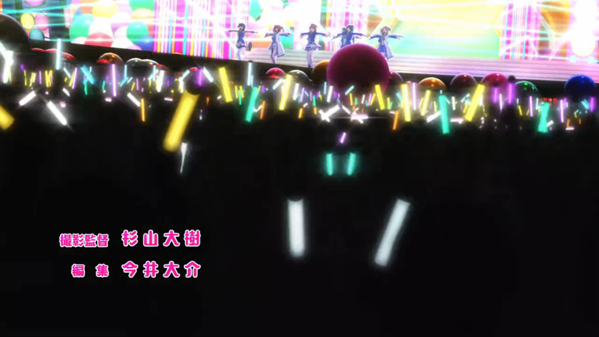

It's finally here!! The first episode of Love Live Sunshine season 2 was broadcasted today! So this week's post is to share my thoughts on the episode. Just to be clear, I'm writing this as soon as I finished watching the whole first season + s2 first episode in one sit so I'm as hyped and into the story as it gets!

<strong>WARNING: THIS POST CONTAINS SPOILERS SO PLEASE WATCH THE EPISODE BEFORE READING</strong>

### Recap

First we start with Chika's nightmare about the Love Live regional prelims. I think Chika feeling so much frustration and guilt after they didn't make it to the Love Live finals that she even has nightmares about it goes to show in a really human way how much she cared about it.

One of the things I realized while re-watching SIP and SS this week, is that Sunshine made the girls (and the drama in general) show their feelings in a more realistic/human light, and to me that's one of the strongest points of the anime and I'm really happy they are keeping it this season as well.

After that we get to see all the characters at the 2nd term entrance ceremony. It's pretty much just a couple of scenes to show us all the aqours members and tells us that even if they didn't won they still had a positive impact in the school situation.

One thing I noticed it's the number of students in each grade:

  - 38 in 3rd grade (36 in the picture + Dia and Mari).
  - 24 in 2nd grade.
  - 12 in 1st grade.

I'm by no means an expert in managing schools but the declining number of students each year shows how big the problem really is and also makes me understand why merging it with another school as soon as possible makes so much sense.

After the opening plays (which I'll be covering after the recap), we get to see the girls doing some stretching before start practicing. Even if they couldn't make it to this year's Love Live, they do plan to participate in the next one and there's a school event upcoming, so they have to practice a lot!

I want us to take a moment here so we can appreciate this beautiful girl who is capable of doing *1 PERFECT PUSH-UP*. In words of Mari: ***IT'S MIRACLE***.

Back to the story, we see the girls chatting while they gives us a couple of little glimpses at the main issue. Mari gets a call and begins to act pretty distracted after that. Kanan notices how Mari isn't being herself, and that night she meets with her to ask about what's happening.

Now, I probably wouldn't have got this one if I hadn't just watch season 1, but they meet after Mari notices Kanan flashing a light at her from the pier. That flash it's like a signal they have since they were kids, so I think that's a pretty nice detail they put in to show us that both are still pretty connected after all that happened.

Anyway, once they met, Kanan confronts Mari and asks her to tell what is she struggling with, and then we get the scene we were all waiting for:

After that Mari realizes that she can't hide the truth, breaks and tells Kanan the problem she's facing. Dia founds out about the problem at the next day after hearing Mari and Kanan discussing about it.

Aqours gets a new place where to practice thanks to You but before they start practice Mari tells everyone the about the problem we have now: the school closing is now decided and they no will no longer be accepting new students, regardless of what happens this term.

Now, this is not an out-of-nowhere situation. We knew since S1 that the school was closing and, as we saw at the beginning of this episode, the declining rate of new entrances is really something to worry about so having the merge decided as soon as possible it's a totally logic decision.

This means aqours is no longer able to fullfil its objective. They can't save the school.

Here it gets pretty depressing and I felt bad for the girls, specially when Chika says *"If we had won at the Love Live prelims and made it to the nationals, I wonder if the future could've been changed..."* Man that really brokoro my kokoro.

And even after she gets home there's a senbazuru that the girls at school made to support Aqours. Remember that, at the end of S1, the whole school went to the regional prelims and supported Aqours at their live because they noticed how hard the members were working to save the school and wanted to help them. Thinking about how shit Chika must have been felt after getting so much support and knowing that they may not be able to do anything to answer that because they can no longer save the school, that... that just hurts so much ;_;

Then we get the scene at the beach, which is a reference to the first episode of S1, when Chika cheered Riko a little bit. Obviously, the atmosphere is different and even if the sounds Riko made were pretty funny (**GAOOOOOOOO!!**), it still feels kinda depressing.

Finally, "casually" all the girls meet at the school's running field earlier than usual. Even if their plans are no longer viable, they all want to keep trying and do what they can until the end. I think that feeling is one of Love Live's core values and what it really matters, so seeing the girls trying their best one more time really made me happy.

---

Now, I probably should've ended this in the last paragraph but there's something it really bothered me with Chika's speech at the end. At the middle she says:

> "I know Mari-chan gave their best already but, me and everyone else, we haven't done anything yet".

Girl, you worked since the school year started, training since early in the morning and after school. On summer vacations, when the weather was hot as hell, everyone practiced without skipping a day. And you also participated in two events and went to Tokyo once just to do research to improve as school idols. Now if that isn't anything, then I'm not sure what you are trying to accomplish to be honest.

I know that wasn't the point of the whole speech and at the end what it matters it's that they are going to keep trying until the end, but it just really bothered me how she dismissed everyone's effort so far, but that just something personal ¯\\\_(ツ)\_/¯.

Also, gotta love how Love Live skirts don't give a shit about physics.

---

#### Opening

The animation quality for the opening dance is god tier, even the 3D felt so good and smooth. Also the live stage's shape looks pretty similar to the one on the first opening so I'm hoping that they do what they did at 1st Live and use that design at Aqours 3rd Live Tour because it looks so beautiful.

The costumes are great and super pretty. They have a mariner uniform style that it really feels like something You would want to design. I must admit I prefer light outfits instead of jackets and coats but I guess that's part of the whole theme they are trying to convey and it looks cool, so it's not something that it bothers me.

The song it's awesome and different in a good way but it keeps the same "idol anison" feeling as AoJan. I'm not sure how to describe it properly as I'm not a musician but if I had to put it into calls, they follow the same classic pattern: Slow rise furi -> Hai -> Part A -> PPPH -> Hai -> Chorus.

Something I noticed and I liked a lot is that this time they are being more considerate with the audience, and even at a small part the focus is entirely in the people rather than in the girls. I really loved this because it felt to me like they are recognizing how important fans are to Love Live! as a whole.

I'm really thankful to whoever that came up with that idea. It was my second favorite part of this new opening, just after Hanamaru's heart pose.

Also, the ending with everyone holding their blades up as the song ends made me smile so much the first time I watched it.

---

#### Ending

I love how this ED starts with a soft intro, keeping the tradition and allowing it to fade in as the episode is ending. This is something I want Love Live to keep in the future as it really gets me hyped every time.

It feels a lot more strong that YumeKataru and it breaks the super cheerful style that Love Live EDs had until now (in a good way), which felt refreshing. The animation was beautiful (except for the bus part) and entertaining to watch. Still, I love waving furis, so I enjoyed that part and can't wait to do that at a live!!

One more thing about the ED: You guys know that I'm a Maru oshi but damn that Dia wink made my heart dokidoki af.

---

## Some final thoughts

It was an awesome beginning. Both music and animation are great and I liked that they are keeping most of the elements I loved in S1. I was expecting them to go full into the third years graduation and what is going to happen to aqours after that as with SIP S2, but instead we are right were season 1 left us. Having seen S1 literally right before this one, it even felt as if they were part of the same season.

This was kinda unexpected because they kept the school closing problem alive, meaning that either this season will address both issues, the school and the third years graduation, or just focus on the school and keep the graduation drama for a movie or even (hopefully) for a third season. My guess, however, is that they will fix the school issue in the first ~5 episodes or they'll manage to delay the decision until after the next year's Love Live, and then they will focus completely on the graduation as they approach the competition on the second half of the season.

Now, there's a little hope I keep that they will go the A-RISE path and instead of disbanding they will keep being idols after the school year ends. This to me will be awesome because then S3 could happen with them struggling to keep the group together after they graduate or something like that. Just remember that this series doesn't have the words "School Idol" in the title ;)

(Hire me Sunrise, I got tons of ideas for a S3 and you can pay me in idol goods.)

Anyway, this episode was a really strong way to start with and I can't wait to see what this season has to offer us.

I think I Love Love Live!
